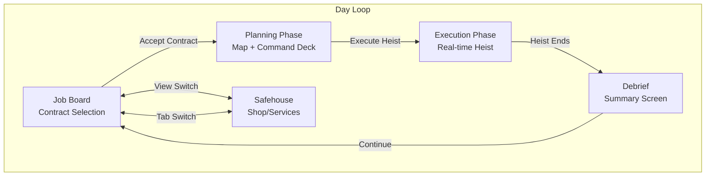
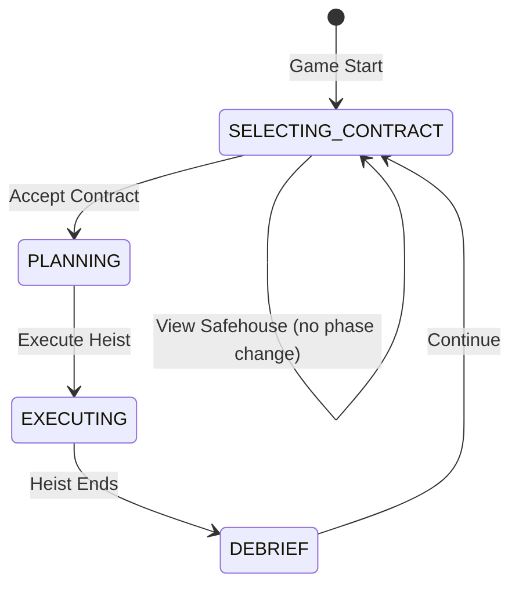

# Project CLOCKWORK - UI/UX Story

> **Purpose:** This document maps every player-facing screen, interaction, and decision point in the current game. It enables designer agents (LLMs) to understand the game experience without playing it.
> 
> **Audience:** LLM agents, designers, future developers
> 
> **Relationship to GDD:** The GDD describes *what the game is*; this document describes *what the player experiences*.

---

## Screen Flow Overview



---

## Persistent HUD (Always Visible)

**Location:** Top of screen, horizontal bar

| Element | Location | Display | Player Interpretation |
|---------|----------|---------|----------------------|
| **Day Counter** | Top-left | `DAY: N` | Progress through run; higher = late game |
| **Cash** | Top-left | `CASH: $1500` | Spendable currency for hiring/gear/services |
| **Intel** | Top-left | `INTEL: 10` | Spent to reveal map sectors; more = safer planning |
| **View Tabs** | Top-center | `TACTICAL MAP` / `SAFEHOUSE` | Switch between main views |
| **Heat Bar** | Top-right | Progress bar 0-100% | Danger meter; at 100% = run ends (BUSTED) |

**Heat Bar Visual States:**
- 0-49%: Cool blue → purple gradient
- 50-79%: Purple warning, subtle pulse
- 80-100%: Red, animated glow — **"I need to manage this"**

---

## Phase 1: Contract Selection (Job Board)

### When It Appears
- **Day 1 Start:** Automatically shown (no map exists yet)
- **After Debrief:** When previous heist ends and new day begins
- **Triggered by:** `GameManager.gameState.simulation.status === 'SELECTING_CONTRACT'`

### What The Player Sees

**Layout:** Full-screen overlay on the map area

```
┌─────────────────────────────────────────────────────────┐
│                  AVAILABLE CONTRACTS                    │
│              Select your next target.                   │
├──────────────┬──────────────┬──────────────────────────┤
│ Contract 1   │ Contract 2   │ Contract 3               │
│ ┌──────────┐ │ ┌──────────┐ │ ┌──────────┐             │
│ │ LAYOUT   │ │ │ LAYOUT   │ │ │ LAYOUT   │             │
│ │ TYPE     │ │ │ TYPE     │ │ │ TYPE     │             │
│ ├──────────┤ │ ├──────────┤ │ ├──────────┤             │
│ │ Name     │ │ │ Name     │ │ │ Name     │             │
│ │ DIFF: ★★ │ │ │ DIFF: ★★★│ │ │ DIFF: ★  │             │
│ │ REWARD:x2│ │ │ REWARD:x3│ │ │ REWARD:x1│             │
│ │          │ │ │          │ │ │          │             │
│ │ Descript │ │ │ Descript │ │ │ Descript │             │
│ │          │ │ │          │ │ │          │             │
│ │[ACCEPT]  │ │ │[ACCEPT]  │ │ │[ACCEPT]  │             │
│ └──────────┘ │ └──────────┘ │ └──────────┘             │
└──────────────┴──────────────┴──────────────────────────┘
```

### Contract Card Elements

| Element | Meaning | Player Decision Weight |
|---------|---------|------------------------|
| **Layout Type** | Building template (e.g., "Standard", "Complex") | Familiarity with layout |
| **Name** | Contract title | Flavor/theming |
| **Difficulty** | ★ rating | Risk assessment |
| **Reward Multiplier** | `x1`, `x2`, `x3` | Risk vs. reward calculation |
| **Description** | Flavor text | Context clues |
| **Debug Info** (dev only) | Room count, guards, cameras | Meta-knowledge |

### Available Actions

| Action | How | Result |
|--------|-----|--------|
| **Accept Contract** | Click `ACCEPT CONTRACT` button | Loads building, transitions to Planning Phase |

### Player Mental Model
> "I'm choosing my next target. Higher difficulty = more reward, but more danger. I should consider my current Heat level and crew strength before picking a hard one."

---

## Phase 2: Safehouse (Shop View)

### When It Appears
- **Tab Switch:** Click `SAFEHOUSE` in the top HUD
- **Cannot access during:** Heist execution

### What The Player Sees

**Layout:** Three-column shop

```
┌──────────────────────────────────────────────────────────┐
│  SERVICES       │  RECRUITMENT     │  BLACK MARKET      │
├─────────────────┼──────────────────┼────────────────────┤
│ BUY INTEL       │ ┌──────────────┐ │ ┌────────────────┐ │
│ Get 5 Intel     │ │ Crew Name    │ │ │ Item Name      │ │
│ [BUY $200]      │ │ ROLE         │ │ │ TYPE           │ │
│                 │ │ STL: 3       │ │ │ Description    │ │
│ LAUNDER MONEY   │ │ TCH: 4       │ │ │ [BUY $300]     │ │
│ Reduce Heat 20% │ │ FRC: 2       │ │ └────────────────┘ │
│ [PAY $500]      │ │ [HIRE $400]  │ │                    │
│                 │ └──────────────┘ │                    │
└─────────────────┴──────────────────┴────────────────────┘
```

### Services Column

| Service | Cost | Effect | Player Consideration |
|---------|------|--------|---------------------|
| **Buy Intel** | $200 | +5 Intel points | "Can I afford to scout more sectors?" |
| **Launder Money** | $500 | -20% Heat | "Is my heat dangerously high?" |

### Recruitment Column (Daily Refresh)

| Card Element | Meaning |
|--------------|---------|
| **Name** | Crew member identity |
| **Role** | Stealth / Tech / Force (determined by highest stat) |
| **Stats** | STL/TCH/FRC — affects interaction checks |
| **Wage** | One-time hire cost |

### Black Market Column (Daily Refresh)

| Card Element | Meaning |
|--------------|---------|
| **Name** | Equipment name |
| **Type** | Equipment slot category |
| **Description** | What it does |
| **Cost** | Purchase price |

### Available Actions

| Action | How | Result |
|--------|-----|--------|
| **Buy Intel** | Click `BUY ($200)` | +5 Intel, -$200 |
| **Launder Money** | Click `PAY ($500)` | -20% Heat, -$500 |
| **Hire Crew** | Click `HIRE $N` | Crew added to Reserves, -$N |
| **Buy Gear** | Click `BUY $N` | Item added to Stash, -$N |
| **Switch to Map** | Click `TACTICAL MAP` tab | Return to contract/planning view |

### Player Mental Model
> "This is my prep screen between heists. I invest cash to strengthen my crew (hiring), improve my intel for better planning, or manage heat if it's getting dangerous. Shop refreshes daily — good deals won't last."

---

## Phase 3: Planning Phase

### When It Appears
- **After contract selection:** Automatically when building loads
- **Heist Phase:** `PLANNING`

### Screen Layout

```
┌─────────────────────────────────────────────────────────────────────┐
│ [HUD BAR - Day, Cash, Intel, Tabs, Heat]                            │
├─────────────────────────────────────────────────────────────────────┤
│                                                                     │
│  ┌───────────────────────────────────────────┐  ┌─────────────────┐ │
│  │                                           │  │ COMMAND DECK    │ │
│  │              TACTICAL MAP                 │  │ ┌─────┬───────┐ │ │
│  │                                           │  │ │ROSTER│PLANNING│ │
│  │   [2D Tile Grid with Fog of War]          │  │ ├─────┴───────┤ │ │
│  │   [Crew Units on Map]                     │  │ │ ACTIVE STACK │ │ │
│  │   [Interactables, Guards visible in FOV]  │  │ │ [Crew Cards] │ │ │
│  │                                           │  │ ├─────────────┤ │ │
│  │                                           │  │ │ RESERVES    │ │ │
│  │                                           │  │ │ [Crew Cards] │ │ │
│  └───────────────────────────────────────────┘  │ ├─────────────┤ │ │
│                                                  │ │ STASH       │ │ │
│  ┌───────────────────────────────────────────┐  │ │ [Items]     │ │ │
│  │ THREAT BAR: ⏸ PLANNING — Click EXECUTE   │  └─────────────────┘ │
│  └───────────────────────────────────────────┘                      │
│  ┌───────────────────────────────────────────┐                      │
│  │ RADIO [SILENT] [LOUD] [SCRAM] (disabled)  │                      │
│  │ [EXECUTE HEIST]                           │                      │
│  └───────────────────────────────────────────┘                      │
└─────────────────────────────────────────────────────────────────────┘
```

### Map View Elements

| Element | Visual | Interaction |
|---------|--------|-------------|
| **Fog of War** | Black overlay | Cannot see or path through |
| **Revealed Sectors** | Grey/dim tiles | Can see walls/doors, can plan routes |
| **Visible Tiles** | Full color | See everything including guards |
| **Crew Units** | Colored circles (🟢 Stealth, 🔵 Tech, 🔴 Force) | Click to select |
| **Interactables** | Icons (🔐 safe, 💻 computer, 🚪 door) | Click to queue interaction |
| **Guards** | Enemy sprites (vision cones visible during EXECUTION only) | Avoid or neutralize |
| **Extraction Points** | ✨ Exit markers | Crew must reach to escape |
| **Sector Icons** | 🔒 Lock icons in hidden sectors | Click to purchase intel |

### Command Deck: ROSTER Tab

**Purpose:** Manage which crew members go on the heist

| Section | Contents | Actions |
|---------|----------|---------|
| **Active Stack** | Crew assigned to this heist (max 4) | Click card → deselect (move to Reserves) |
| **Reserves** | Crew not assigned | Click card → select (move to Active) |
| **Stash** | Owned equipment | Click item → equip to selected crew |

### Crew Card Elements

| Element | Display | Meaning |
|---------|---------|---------|
| **Name** | Character name | Identity |
| **Role Badge** | STEALTH / TECH / FORCE | Specialization |
| **Stats** | STL/TCH/FRC numbers | Performance in skill checks |
| **Equipment Slots** | Up to 2 items | Equipped gear |
| **Selection State** | Border highlight | In Active Stack or not |

### Command Deck: PLANNING Tab

**Purpose:** Purchase intel (reveal sectors) and arrangements (assets)

| Section | Contents |
|---------|----------|
| **Intel Header** | Current Intel points, cost to reveal next sector |
| **Sector List** | Available sectors with buy buttons |
| **Arrangements Tray** | Purchasable assets (bribes, distractions, etc.) |

### Unit Context Menu (Appears on Unit Selection)

**Purpose:** Program crew objectives for execution

**Current Implementation:** Uses the **SetupPhaseUI** panel in the Command Deck PLANNING tab rather than a popup menu attached to units.

**Layout:** Selected unit's objectives shown in PLANNING tab:

```
┌──────────────────────────────────────┐
│ SELECTED: [Unit Name]                │
├──────────────────────────────────────┤
│ Objectives:                          │
│   1. MOVE to (12, 8)                 │
│   2. INTERACT: Vault Safe            │
│   3. MOVE to Extraction              │
│ [+ Add Objective]                    │
└──────────────────────────────────────┘
```

| Element | Action |
|---------|--------|
| **Unit Name** | Currently selected crew member |
| **Objective List** | Ordered list of queued tasks |
| **+ Add Objective** | Opens goal selector |

**Goal Selector Flow:**
1. Select crew unit on map (or click in Roster)
2. Click `+ Add Objective` in PLANNING tab
3. **Choose action type:** MOVE / INTERACT / WAIT / EXTRACT
4. **Select target:** Click on map tile or interactable
5. Objective added to queue

> **Note:** The map shows a dotted path line connecting the unit's queued MOVE objectives during planning.

### Available Actions in Planning

| Action | How | Result |
|--------|-----|--------|
| **Select Unit** | Click crew on map | Shows Unit Context Menu |
| **Add Objective** | Via Unit Context Menu | Queues task for execution |
| **Toggle Crew** | Click crew card in Roster | Add/remove from Active Stack |
| **Equip Item** | Click item in Stash, then crew | Assign equipment |
| **Buy Sector Intel** | Click sector in Planning tab | Reveals sector, costs Intel |
| **Buy Arrangement** | Click asset in Planning tab | Activates modifier/ability, costs Cash |
| **Execute Heist** | Click `EXECUTE HEIST` button | Transition to Execution Phase |

### Player Mental Model
> "This is my setup time. I need to:
> 1. Pick the right crew for the job (Active Stack)
> 2. Equip them appropriately
> 3. Use Intel to reveal dangerous areas
> 4. Buy arrangements that help (bribed guards, vault codes)
> 5. Program their objectives (what to steal, where to go)
> 
> Once I hit Execute, it runs in real-time — I can only adjust via radio commands."

---

## Map Deep Dive: Tactical Map Mechanics

This section provides granular detail on all map interactions for agents who need to understand spatial gameplay without visual access.

### Map Viewport & Camera

**Canvas Behavior:**
- The map is a 2D tile grid rendered on an HTML canvas
- **Viewport:** Matches the `#game-map` container dimensions (~1700×500 pixels typical)
- **Scrolling:** Arrow keys or click-drag to pan the view
- **No zoom:** Currently fixed scale (32×32 pixels per tile)

**Coordinate Systems:**
| System | Description | Example |
|--------|-------------|---------|
| **Grid Coords** | Tile position (0-indexed integers) | `(15, 26)` = tile at column 15, row 26 |
| **World Coords** | Pixel position on full map | `(480, 832)` = pixel location |
| **Screen Coords** | Pixel position in viewport | Relative to camera offset |

### Crew Units on Map

**Visual Representation:**
- Each crew member is a colored circle (32×32 pixels)
- **Color coding by primary stat:**
  - 🔴 Red = Force-dominant (combat specialist)
  - 🔵 Blue = Tech-dominant (hacker/electronics)
  - 🟢 Green = Stealth-dominant (infiltrator)

**Spawn Behavior:**
- Crew spawns near the **entry point** (typically bottom of map, around tile `(15, 26)`)
- Units spawn in staggered positions to avoid overlap
- Empty roster = no units on map (must add from Reserves first)

**Selection Mechanics:**

| Action | Input | Visual Feedback |
|--------|-------|-----------------|
| **Select Unit** | Left-click on unit | Unit gets highlight border, context menu appears |
| **Deselect** | Click elsewhere | Highlight removed, context menu hidden |
| **Cycle Selection** | Click another unit | Selection transfers |

**Selected Unit State:**
- `window.selectedUnit` holds the currently selected unit object
- `window.planningUnitId` syncs with Command Deck crew highlight
- Selection persists until explicitly changed

### Objective Queue System

**Concept:**
Each crew member has an **objective queue** — a list of tasks they will execute in order during the heist. During Planning, the player programs this queue. During Execution, the unit works through it automatically.

**Queue Visualization:**

```
🚀 START ──→ [MOVE to Vault] ──→ [CRACK Safe] ──→ [MOVE to Exit]
              ↓                    ↓                ↓
           Waypoint            Interactable      Extraction
```

**Objective Structure:**

| Field | Type | Description |
|-------|------|-------------|
| **type** | `MOVE` / `INTERACT` / `WAIT` / `SIGNAL` | What the unit will do |
| **target** | Coordinates or entity | Where/what to act on |
| **trigger** | `IMMEDIATE` / `WAIT_SIGNAL` / `DELAY` | When to start this objective |
| **status** | `QUEUED` / `ACTIVE` / `COMPLETE` / `FAILED` | Runtime state |

**Objective Types:**

| Type | Description | Target | Duration |
|------|-------------|--------|----------|
| **MOVE** | Walk to a tile | Grid coordinates | Path length ÷ speed |
| **INTERACT** | Use an interactable | Entity (safe, door, etc.) | Skill check + action time |
| **WAIT** | Stand still | N/A | Fixed duration or until signal |
| **SIGNAL** | Broadcast to team | Signal channel name | Instant |

**Adding Objectives (Planning Phase):**

1. **Select crew unit** on map → Context menu appears
2. **Click `+ ADD`** → Category menu opens
3. **Choose category** (MOVE, INTERACT, WAIT, SIGNAL)
4. **Select target:**
   - MOVE → Click destination tile on map
   - INTERACT → Click target interactable
   - WAIT → Enter duration
   - SIGNAL → Name the signal
5. **Set trigger** (when this objective starts)
6. Objective added to end of queue

**Trigger Conditions:**

| Trigger | Meaning | Use Case |
|---------|---------|----------|
| **IMMEDIATE** | Start as soon as previous objective completes | Normal sequential flow |
| **WAIT_SIGNAL** | Wait for named signal from another unit | Synchronized actions |
| **DELAY** | Wait N seconds after previous completes | Timing-sensitive operations |

**Queue Modification (Planning Only):**
- **Reorder:** Drag objectives in the queue strip
- **Remove:** Click X on objective node
- **Clear:** Remove all objectives from queue

### Interactables

These are entities on the map that crew can interact with via INTERACT objectives.

**Interactable Types:**

| Type | Icon | Skill Used | Success Effect | Fail Effect |
|------|------|------------|----------------|-------------|
| **Safe** | 🔐 | Tech | Opens, reveals loot | Alert triggered, locked |
| **Computer** | 💻 | Tech | Disable cameras/alarms | Alert triggered |
| **Security Panel** | 🔧 | Tech | Disarm sector alarms | Alert triggered |
| **Door (Locked)** | 🚪 | Tech or Force | Opens passage | Makes noise (Force) |
| **Extraction Point** | 🚪✨ | None | Crew escapes map | N/A |

**Skill Checks:**
- Each interaction has a **difficulty rating** (e.g., "Requires Tech 3")
- Crew stat must meet or exceed difficulty to auto-succeed
- Below threshold → failure chance based on gap

**Interaction Workflow:**

```
Unit arrives at interactable
        ↓
   [Skill Check]
        ↓
   ┌────┴────┐
Success    Fail
   ↓          ↓
Effect    Consequences
applied   (alert, noise)
```

### Guards & Detection

**Guard Visual:**
- Enemy units shown as distinct sprites
- Each guard has a **vision cone** (rendered during Execution only)
- Guards patrol or stand guard based on their AI routine

**Vision Cone Properties:**

| Property | Value | Meaning |
|----------|-------|---------|
| **Range** | ~6 tiles | How far they can see |
| **FOV** | 90° | Angular width of vision |
| **Color** | Red (alert) / Dim red (normal) | Detection state |

**Vision Cone Visibility Rules:**
- Hidden during PLANNING phase (player must use Intel to reveal guard positions)
- Visible during EXECUTION if guard's tile is **REVEALED** or **VISIBLE**
- Not shown for guards in fogged/hidden sectors

**Detection Mechanics:**

| Detection State | Meter Value | Guard Behavior |
|-----------------|-------------|----------------|
| **Unaware** | 0% | Normal patrol |
| **Suspicious** | 1-49% | Pauses, looks around |
| **Investigating** | 50-99% | Moves toward last seen position |
| **Alerted** | 100% | Pursues, triggers alarm |

**Detection Flow:**

```
Crew unit in vision cone
        ↓
  Detection meter fills
  (rate based on distance, cover, stealth stat)
        ↓
  Crew exits cone → meter drains
        ↓
  Meter hits 100% → DETECTION EVENT
        ↓
  ● Guard alerted
  ● Heat increases
  ● Threat clock accelerates
```

**Stealth Modifiers:**

| Factor | Effect on Detection |
|--------|---------------------|
| **Crew STL stat** | Higher = slower detection rate |
| **Distance** | Closer = faster detection |
| **Movement** | Moving = easier to detect than stationary |
| **Cover tiles** | Some tiles reduce detection rate |
| **Radio Mode SILENT** | Reduces movement speed but harder to detect |
| **Radio Mode LOUD** | Faster movement but instant detection |

### Fog of War

**Visibility States:**

| State | Visual | What Player Sees | How to Achieve |
|-------|--------|------------------|----------------|
| **HIDDEN** | Black overlay | Nothing | Default for all tiles |
| **REVEALED** | Grey/dim | Walls, floors, interactable icons | Purchase sector Intel |
| **VISIBLE** | Full color | Everything including guards, details | Crew line-of-sight |

**Intel Purchase Flow:**
1. Go to Command Deck → PLANNING tab
2. See list of **sectors** (named areas like "Vault", "Security Room")
3. Each sector has Intel cost (1-4 based on importance)
4. Click BUY → Spend Intel → Sector becomes REVEALED
5. Guards in that sector now visible when crew can see them

**Sector Examples:**

| Sector Name | Typical Intel Cost | Contains |
|-------------|-------------------|----------|
| Lobby | 1 | Entry area, basic guards |
| Hallway | 1 | Corridors between rooms |
| Office | 2 | Computers, some loot |
| Security | 3 | Security panels, camera controls |
| Server Room | 3 | High-value computer access |
| Vault | 4 | Main score, heavy security |

### Pathfinding & Movement

**How Units Move:**
- A* pathfinding on the tile grid
- Units avoid walls, locked doors, and other units
- Path shown as dotted line when MOVE objective is queued (Planning only)

**Movement Speed:**

| Radio Mode | Speed Multiplier | Detection Risk |
|------------|------------------|----------------|
| SILENT | 0.5x (slow) | Very low |
| NORMAL | 1.0x | Normal |
| LOUD | 1.5x (fast) | Instant if seen |

**Pathing Constraints:**
- Cannot path through HIDDEN sectors (no route info)
- Cannot path through locked doors (must unlock first)
- Cannot path through other units (will wait for clear)

---

### Threat Clock (Execution Timer)

The Threat Clock is the primary tension mechanic during heist execution. It controls escalation and determines when reinforcements arrive.

**Visual Location:** Bottom of screen, horizontal bar above Radio Panel

**Clock Behavior:**

| State | Visual | Meaning |
|-------|--------|---------|
| **Paused** | Grey bar, "PLANNING" label | During planning phase |
| **Running** | Animated fill, zone label | During execution |
| **Accelerated** | Faster fill, red pulse | Detection event occurred |

**Zone Progression:**

```
CASUAL ──→ ALERT ──→ LOCKDOWN ──→ SWAT
  30s       60s        90s       120s+
```

| Zone | Duration | Guard Behavior | Player Pressure |
|------|----------|----------------|-----------------|
| **CASUAL** | 0-30s | Normal patrols | Low — take your time |
| **ALERT** | 30-60s | Faster detection | Medium — be careful |
| **LOCKDOWN** | 60-90s | Active search patterns | High — move quickly |
| **SWAT** | 90s+ | Maximum aggression | Critical — extract NOW |

**Acceleration Events:**
- Guard detects crew → +10s acceleration
- Alarm triggered → +20s acceleration
- Going LOUD radio → Instant jump to ALERT zone

**Player Mental Model:**
> "The clock is always ticking. Every second I spend inside, the danger escalates. I need to balance thorough looting against getting out before SWAT arrives."

### Arrangements (Purchasable Advantages)

Arrangements are one-time purchases during Planning that give tactical advantages during the heist.

**Location:** Command Deck → PLANNING Tab → Arrangements Tray

**Available Arrangements (Building-Specific):**

| Arrangement | Cost | Effect |
|-------------|------|--------|
| **Phone Distraction** | $200 | One guard leaves position for 30s |
| **Power Cut** | $500 | Cameras disabled for 60s |
| **Bribe Lobby Guard** | $300 | Lobby guard ignores crew |
| **Vault Access Codes** | $400 | Vault safe auto-succeeds |

**Purchase Flow:**
1. View available arrangements in PLANNING tab
2. Each shows name, cost, and effect description
3. Click to purchase (deducts from Cash)
4. Arrangement activates automatically during execution

**Strategic Value:**
- Expensive but can make difficult heists easier
- Building-specific — not all arrangements available on all maps
- One-time use per heist

---

## Phase 4: Execution Phase

### When It Appears
- **Trigger:** Click `EXECUTE HEIST` button
- **Heist Phase:** `EXECUTING`

### Visual Changes from Planning

| Element | Change |
|---------|--------|
| **Threat Bar** | Starts moving, shows zone + timer |
| **Execute Button** | Hidden |
| **Radio Panel** | Enabled (SILENT active by default) |
| **View Tabs** | Disabled (cannot switch during heist) |
| **Crew Units** | Begin executing queued objectives |
| **Unit Context Menu** | Read-only (cannot edit during execution) |

### Threat Bar Zones

| Zone | Color | Effect on Guards |
|------|-------|------------------|
| **CASUAL** | Green | Normal patrol behavior |
| **ALERT** | Yellow | Faster detection, tighter patrols |
| **LOCKDOWN** | Orange | All doors lock, guards search |
| **SWAT** | Red | Maximum difficulty, reinforcements |

### Radio Controls

| Button | Effect | Use Case |
|--------|--------|----------|
| **SILENT** | Slower movement, harder to detect | Default stealth approach |
| **LOUD** | Faster movement, guards fully alerted | Abort stealth, speed run |
| **SCRAM** | All units flee to exit immediately | Emergency abort |

### Event Log (Center Screen)

**Purpose:** Real-time feedback on heist events

| Event Type | Example | Color |
|------------|---------|-------|
| **Success** | "Vault cracked successfully" | Green |
| **Warning** | "Guard spotted Shadow" | Yellow |
| **Failure** | "Lockpick failed" | Red |

### Available Actions in Execution

| Action | How | Result |
|--------|-----|--------|
| **Change Radio Stance** | Click SILENT / LOUD / SCRAM | Affects all crew behavior |
| **Watch** | Observe | Heist runs automatically based on queued objectives |

### Player Mental Model
> "The plan is in motion. I can't change what they're doing, only how they do it. If things go bad, I can:
> - Go LOUD to move faster (sacrificing stealth)
> - SCRAM to abort and save the crew
> 
> My goal is to extract with The Score and everyone alive."

### Heist End Conditions

| Condition | Result |
|-----------|--------|
| **All crew at extraction with Score** | Victory → Debrief |
| **All crew at extraction without Score** | Partial success → Debrief |
| **All crew captured** | Disaster → Debrief |
| **Timer expires (SWAT zone ends)** | Failure → Debrief |

---

## Phase 5: Debrief (Heist Summary)

### When It Appears
- **Trigger:** `heistComplete` event dispatched
- **Automatically overlays** the game screen

### What The Player Sees

```
┌─────────────────────────────────────────────────────────┐
│           🏆 PERFECT SCORE                              │
│     "Flawless execution. The Mastermind delivers."      │
├─────────────────────────────────────────────────────────┤
│ 💰 Loot Extracted                                        │
│    ⭐ Main Vault Diamond ................ $50,000       │
│       Side Office Cash .................. $2,000        │
│    ─────────────────────────────────────────────        │
│    Total: $52,000                                       │
├─────────────────────────────────────────────────────────┤
│ 👥 Crew Status                                          │
│    ✅ Escaped: 3                                        │
│    ❌ Captured: 0                                       │
├─────────────────────────────────────────────────────────┤
│ 🔥 Heat Change                                          │
│    ▲ +15 Heat                                           │
├─────────────────────────────────────────────────────────┤
│                   [Continue]                            │
└─────────────────────────────────────────────────────────┘
```

### Outcome Tiers

| Tier | Meaning | Color |
|------|---------|-------|
| **PERFECT_SCORE** | Score + all crew + no detections | Gold 🏆 |
| **CLEAN_SWEEP** | Score + all crew escaped | Green ✨ |
| **PROFESSIONAL** | Score + some crew captured | Blue 💼 |
| **SALVAGE** | No score, but some loot | Orange 📦 |
| **BUST** | Nothing extracted | Red 💨 |
| **DISASTER** | All crew captured | Dark Red 💀 |

### Available Actions

| Action | How | Result |
|--------|-----|--------|
| **Continue** | Click `Continue` button | Closes summary, starts new day, shows Job Board |

### Player Mental Model
> "This is my report card. Did I get The Score? Did everyone survive? How much heat did I generate? This informs my next contract choice — if heat is high, I might need to launder or pick an easier job."

---

## State Reference

### Key Game State Values

| State Path | Meaning | UI Display |
|------------|---------|------------|
| `meta.currentDay` | Day number in run | DAY: N |
| `meta.cash` | Available money | CASH: $N |
| `meta.intel` | Scouting points | INTEL: N |
| `resources.heat` | Danger level (0-100) | Heat bar fill |
| `simulation.status` | Current phase | Controls which UI is shown |
| `grid.phase` | PLANNING or EXECUTING | Controls interactions |
| `crew` | Active crew roster | Command Deck cards |
| `inventory` | Owned items | Stash section |
| `shop.hires` | Available recruits | Recruitment column |
| `shop.items` | Available gear | Black Market column |

### Phase Transitions



---

## Quick Reference: All Interactive Elements

| Context | Element | Action |
|---------|---------|--------|
| **Job Board** | Contract Card → Accept | Load building, start planning |
| **Safehouse** | Services → Buy Intel | +5 Intel |
| **Safehouse** | Services → Launder | -20% Heat |
| **Safehouse** | Recruit Card → Hire | Add crew to Reserves |
| **Safehouse** | Gear Card → Buy | Add item to Stash |
| **HUD** | View Tabs | Switch Map ↔ Safehouse |
| **Command Deck** | Deck Tabs | Switch Roster ↔ Planning |
| **Command Deck** | Crew Card | Toggle Active/Reserve |
| **Command Deck** | Item → Crew | Equip item |
| **Planning Tab** | Sector → Buy | Reveal sector |
| **Planning Tab** | Asset → Buy | Activate arrangement |
| **Map** | Crew Unit → Click | Select unit, show context menu |
| **Unit Context** | + ADD | Open goal selector |
| **Goal Selector** | Category → Target → Trigger | Queue objective |
| **Action Panel** | Execute Heist | Start real-time heist |
| **Radio Panel** | SILENT / LOUD / SCRAM | Change crew behavior |
| **Debrief** | Continue | End heist, new day |

---

*Last Updated: 2026-01-07*
*Related: [GDD_v5.md](GDD_v5.md), [ARCHITECTURE.md](ARCHITECTURE.md)*
